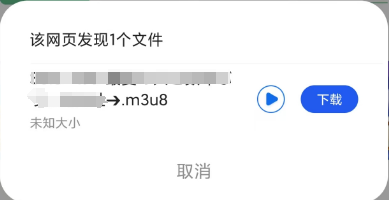
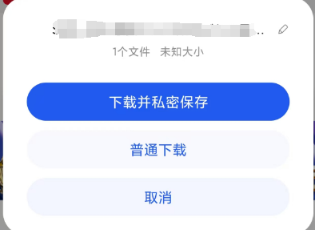

# 关于如何下载（某些）网站的.m3u8视频并转换为Mp4格式
## 很多时候我们想要下载（某些）网站的视频没有下载按键，
## 我提供一下我的下载方法（.m3u8格式为例，由于我的设备有限，不保证在其他设备有效，希望大家尝试给我反馈）
&emsp;1.如果在Chrome或Edge访问视频网站，正常情况下视频没有下载按键，会有分享键 
  
  
随便选取一个，出现链接“已复制”的弹窗，即为分享链接复制成功(链接放到视频解析软件或解析网站上一般是无法直接下载的)  
&emsp;2.切换到手机设备（我的设备是Redmi K70，推荐HyperOS，对GMS的兼容性很好）切换到QQ浏览器访问地址，利用手机QQ浏览器的资源嗅探功能  
点击资源嗅探按键  
  
  
选择普通下载或私密下载（此时下载的视频为.m3u8格式）,  
  
&emsp;3.下载完成后在QQ浏览器的"文件-视频"对应.m3u8格式视频下选择“转mp4”选项，完成切换;  
（.m3u8格式在手机浏览器可以直接播放，如图，但PC端Chromium 内核的浏览器不能直接播放.m3u8的直播源。需要安装 HLS 相关的扩展才可以从地址栏访问并播放直播源。这边目前使用的是 Native HLS Playback 这个扩展,安装好之后直接从地址栏访问 .m3u8 的地址就直接开始播放了）
